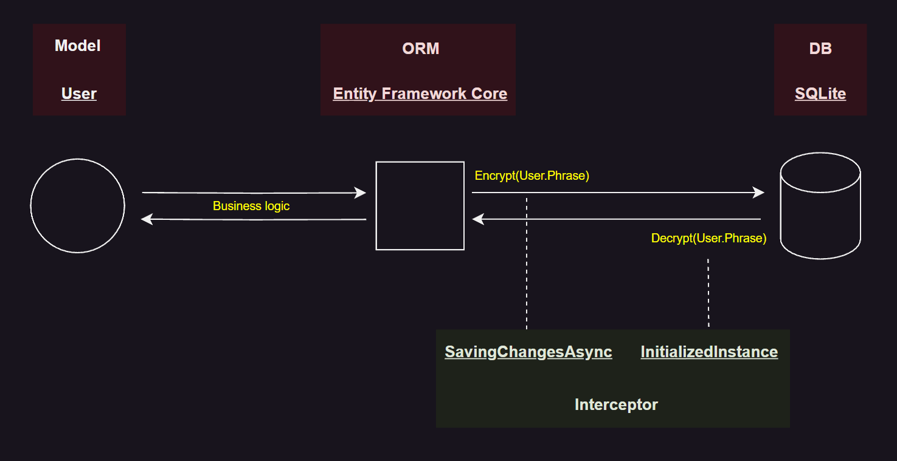

# User EFC Interceptor
Web API with `Enitiy Framework Core` `Interceptor` usage for `User` model

## Development technologies
- **ASP.NET.Core Web API**
- **Entity Framework Core**
- **SQLite**
- **Serilog**
- **AutoMapper**

## Description
`Enitiy Framework Core` `Interceptor` in app let separate `convert model logic` from `business logic`:
- `[APP -> DB]`: Before adding the `User` to the DB, the `User.Phrase` is encrypted
- `[DB -> APP]`: Before receiving the `User.Phrase` in the App, the `User.Phrase` is decrypted

## Usage
API has 2 endpoints:
1. **AddUser** - `POST` request on URI `/api/User` with `From` parameters:
    - username
    - phrase
2. **GetUserPhrase** - `GET` request on URI `/api/User` with `Query` parameter:
    - username
